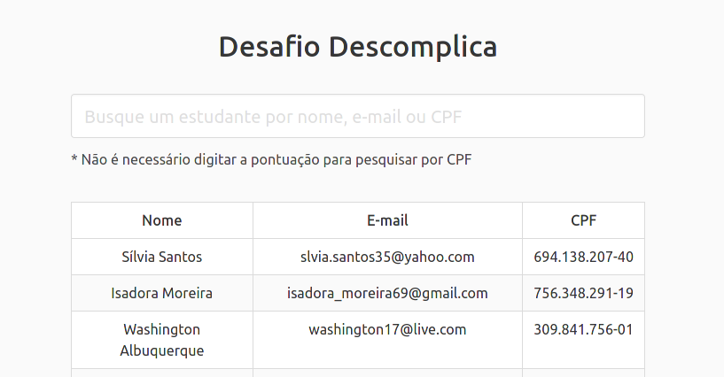
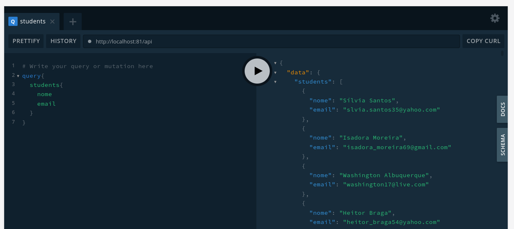

# TL;DR

Nesse projeto, estamos utilizando docker para servir tudo que seja necessário para aplicação e docker-compose para orquestrar os containers. Caso não conheça algum dos dois, recomendo a leitura da documentação **[aqui](https://docs.docker.com/)** e **[aqui](https://docs.docker.com/compose/)**.

Para executar a aplicação, renomeie os arquivos `.env-example` nas pastas **`api`** e **`front`** para `.env`.

Em seguida, execute:

> $ docker-compose up -d

Quando os containers estiverem prontos, será possível acessar duas urls:

A aplicação, escrita em React, que exibe uma lista de estudantes previamente cadastrados

> $ http://localhost:81



Um "playground" para GraphQL

> $ http://localhost:81/api

> 

_Todos os dados cadastrados foram gerados automaticamente e qualquer semelhança com a possíveis dados reais será mera coincidência_

# API

Para a API, utilizamos Apollo Server + Mongoose.

Para essa parte, desenvolvemos uma API simples com GraphQL que deverá retornar os estudantes cadastrados previamente na nossa base.

Desenvolvida em js, usamos Mongoose + GraphQL + Apollo Server

Babel será utilizado para fazer a transpilação do ES6.

# Front

Aplicação web em React + TypeScript que vai consumir os dados da nossa API.

# docker-compose

Usamos docker-compose para gerenciar a aplicação. Optamos por organizar ele da seguinte maneira:

```docker-compose.yml
version: "3"

services:
  mongo:
    container_name: mongoose
    image: mongo
    restart: unless-stopped
    ports:
      - 27017:27017
    deploy:
      resources:
        limits:
          cpus: "1"
          memory: 512M
  descomplica-api:
    container_name: graphql-api
    build:
      context: ./api/
      target: dev
    volumes:
      - .:/api
    command: >
      sh -c "npm run seed && npm run dev"
    ports:
      - "4000:4000"
    environment:
      NODE_ENV: development
    env_file:
      - ./api/.env
    deploy:
      resources:
        limits:
          cpus: "1"
          memory: 512M
    depends_on:
      - mongo
  react-app:
    container_name: web-app
    ports:
      - "3000:3000"
    build:
      context: ./front/
      dockerfile: Dockerfile
    volumes:
      - ./front:/app
    command: >
      sh -c "npm rebuild node-sass && npm run start"
    env_file:
      - ./front/.env
    deploy:
      resources:
        limits:
          cpus: "1"
  nginx:
    container_name: reverse-proxy
    image: nginx:1.13
    ports:
      - "81:80"
    depends_on:
      - react-app
    volumes:
      - ./nginx/nginx.conf:/etc/nginx/conf.d/default.conf:ro
```
